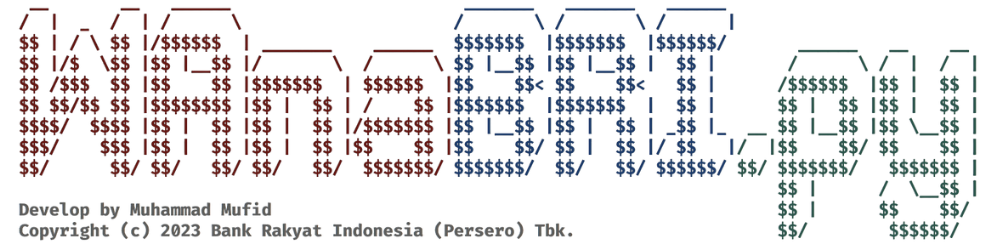

<h1 align="center">
  </a>
  <br>
  WAnaBRI
</h1>
<p align="center">
  <b>The Web Application Firewall (WAF) Analyzer tool for BRI</b>
</p>

# Features

<h1 align="left">
  </a>
  <br>
</h1>

`WAnaBRI` is a specialized tool developed by Bank Rakyat Indonesia (BRI) for the purpose of analyzing web application firewalls (WAFs). As part of BRI's commitment to cybersecurity, this tool plays a crucial role in identifying and understanding the behavior of various WAFs. `WAnaBRI` serves as an essential component in BRI's ongoing efforts to maintain the integrity and security of its web applications and services.

### `WAnaBRI` has three main feature
- Subdomain enumeration
- WAF footprinting (soon)
- WAF testing (soon)

# How does it work?

To do its magic, WAnaBRI does the following:

### Subdomain Enumeration

- Enumerate subdomain from target using [SubFinder](https://github.com/projectdiscovery/subfinder)
- Probe the domain name using [httprobe](https://github.com/tomnomnom/httprobe), - - Filter the domain using domain_checker.


# Usage

```sh
python3 WAnaBRI.py -h
```
This will display help for the tool. Here are all the options it support.

```yaml
usage: WAnaBRI.py [-h] [-S] [-t TARGET] [-o OUTPUT] [-V] [--no-colors]

Web Application Firewall (WAF) Analyser BRI - WAnaBRI

options:
  -h, --help            show this help message and exit
  -S, --subdomain-enumeration
                        Enumerate subdomains using SubFinder
  -t TARGET, --target TARGET
                        Target domain or path to a .txt file containing domains ex: -t bri.co.id or -t
                        domains.txt
  -o OUTPUT, --output OUTPUT
                        Name of the output file ex -o output.txt
  -V, --version         Print out the current version of WAnaBRI and exit.
  --no-colors           Disable ANSI colors in output.
```
# Installation

`WAnaBRI` requires **go1.20** to install dependency tools successfully. How to install go could be found [here](https://noureldinehab.medium.com/how-to-install-golang-latest-version-on-kali-linux-1afa2bd64ace). The `TOKEN` can be obtained by asking Muhammad Mufid at muhammad.mufid@corp.bri.co.id or by contacting him via WhatsApp at 081328550320.

```console
$ git clone https://<TOKEN>@github.com/Mufid1804/WAnaBRI.git
$ cd WAnaBRI
$ pip3 install -r requirements.txt
$ chmod +x install_tools.sh
$ ./install_tools.sh
```
# Running WAnaBRI
### Subdomain Enumeration

To run the subdomain enumeraton on a target, just use the following command.

```console
python3 WAnaBRI.py -S -t hackerone.com

 
 __       __   ______                       _______   _______   ______                         
/  |  _  /  | /      \                     /       \ /       \ /      |                                                                                                                                                                     
$$ | / \ $$ |/$$$$$$  | _______    ______  $$$$$$$  |$$$$$$$  |$$$$$$/       ______   __    __                                                                                                                                              
$$ |/$  \$$ |$$ |__$$ |/       \  /      \ $$ |__$$ |$$ |__$$ |  $$ |       /      \ /  |  /  |                                                                                                                                             
$$ /$$$  $$ |$$    $$ |$$$$$$$  | $$$$$$  |$$    $$< $$    $$<   $$ |      /$$$$$$  |$$ |  $$ |                                                                                                                                             
$$ $$/$$ $$ |$$$$$$$$ |$$ |  $$ | /    $$ |$$$$$$$  |$$$$$$$  |  $$ |      $$ |  $$ |$$ |  $$ |                                                                                                                                             
$$$$/  $$$$ |$$ |  $$ |$$ |  $$ |/$$$$$$$ |$$ |__$$ |$$ |  $$ | _$$ |_  __ $$ |__$$ |$$ \__$$ |                                                                                                                                             
$$$/    $$$ |$$ |  $$ |$$ |  $$ |$$    $$ |$$    $$/ $$ |  $$ |/ $$   |/  |$$    $$/ $$    $$ |                                                                                                                                             
$$/      $$/ $$/   $$/ $$/   $$/  $$$$$$$/ $$$$$$$/  $$/   $$/ $$$$$$/ $$/ $$$$$$$/   $$$$$$$ |                                                                                                                                             
                                                                           $$ |      /  \__$$ |                                                                                                                                             
Develop by Muhammad Mufid                                                  $$ |      $$    $$/                      
Copyright (c) 2023 Bank Rakyat Indonesia (Persero) Tbk.                    $$/        $$$$$$/                       
                                                                                                                    
[*] The target website is hackerone.com
[*] Starting subdomain enumeration for hackerone.com using SubFinder

[~] Done! Here's the output:

api.hackerone.com
mta-sts.hackerone.com
fwdkim1.hackerone.com
zendesk1.hackerone.com
a.ns.hackerone.com
b.ns.hackerone.com
resources.hackerone.com
links.hackerone.com
docs.hackerone.com
mta-sts.forwarding.hackerone.com
gslink.hackerone.com
mta-sts.managed.hackerone.com
go.hackerone.com
hackerone.com
events.hackerone.com
zendesk2.hackerone.com
zendesk3.hackerone.com
zendesk4.hackerone.com
www.hackerone.com
info.hackerone.com
support.hackerone.com
design.hackerone.com

[~] File output saved to log/subdomain-enumeration--2023-08-05--12-22-58.txt

[*] The next step is to check the domains using domain_checker
[+] Do you want to continue? (Y/n):
```
# Support

For any issues or support, please contact Muhammad Mufid at muhammad.mufid@corp.bri.co.id.

# License

Copyright (c) 2023 Bank Rakyat Indonesia (Persero) Tbk. For internal purpose use only.
